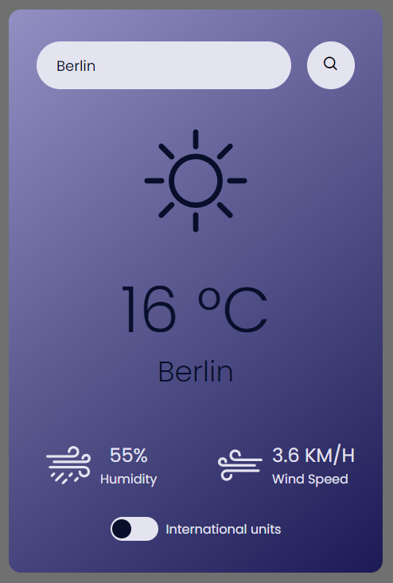

# Simple Weather App

### Author: Dani (Angelica) S.

--

 

--

A basic weather application made using HTML, CSS, and JavaScript. 
* Responsive website
* Search by city name (with validation)
* "On-the-fly" DOM changes
* International units toggle
* API usage
  
--

Credits:
* [Weather API](https://openweathermap.org/api)
* [Tutorial](https://youtu.be/MIYQR-Ybrn4?si=WNdA4WnE4HuPoPJX)
